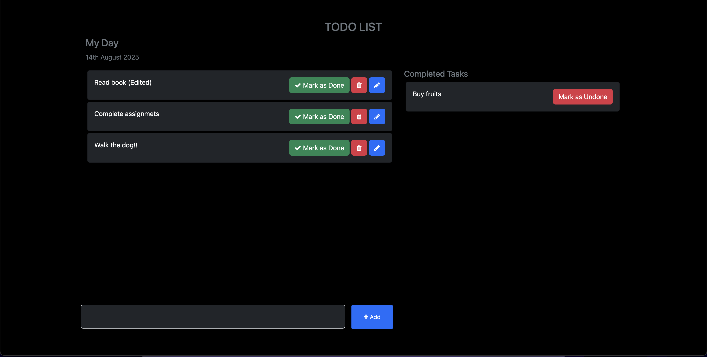
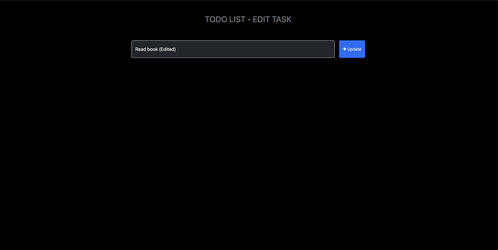

# Django TODO Application 📝

A simple and intuitive TODO application built with Django as my first Django project. This application allows users to manage their daily tasks efficiently with basic CRUD (Create, Read, Update, Delete) operations.

## Screen Shots :




## Features ✨

- **Add Tasks**: Create new TODO items with descriptions
- **View Tasks**: Display all tasks in an organized list
- **Edit Tasks**: Update existing task details
- **Delete Tasks**: Remove completed or unwanted tasks
- **Task Status**: Mark tasks as completed or pending


## Technologies Used 🛠️

- **Backend**: Django (Python Web Framework)
- **Frontend**: HTML5, CSS3, Bootstrap
- **Database**: SQLite (Django's default database)
- **Version Control**: Git & GitHub

## Project Structure 📁

```
TODO-Django/
├── requirements.txt
├── README.md
├── manage.py
├── db.sqlite3
├── .gitignore
├── todo_main/
│   ├── __init__.py
│   ├── settings.py
│   ├── urls.py
│   ├── wsgi.py
│   └── asgi.py
├── todo/
│   ├── __init__.py
│   ├── admin.py
│   ├── apps.py
│   ├── models.py
│   ├── views.py
│   ├── urls.py
│   ├── migrations/
│   └── templates/
│       └── todo_app/
├── templates/
│   ├── home.html/
│   └── edit_task.html/
└── public/
    ├── Pic-1.png/
    └── Pic-2.png/
```

## Installation & Setup 🚀

### Prerequisites
- Python 3.8 or higher
- pip (Python package manager)
- Git

### Step-by-step Installation

1. **Clone the repository**
   ```bash
   git clone https://github.com/AmithBV0606/TODO-Django.git
   cd TODO-Django
   ```

2. **Create a virtual environment**
   ```bash
   python -m venv venv
   ```

3. **Activate the virtual environment**
   
   On Windows:
   ```bash
   venv\Scripts\activate
   ```
   
   On macOS/Linux:
   ```bash
   source venv/bin/activate
   ```

4. **Install required dependencies**
   ```bash
   pip install -r requirements.txt
   ```
   
   If requirements.txt is not available, install Django manually:
   ```bash
   pip install django
   ```

5. **Run database migrations**
   ```bash
   python manage.py makemigrations
   python manage.py migrate
   ```

6. **Create a superuser (optional)**
   ```bash
   python manage.py createsuperuser
   ```

7. **Start the development server**
   ```bash
   python manage.py runserver
   ```

8. **Access the application**
   Open your web browser and navigate to: `http://127.0.0.1:8000/`

## Usage 💡

1. **Adding a Task**: Click on "Add Task" button and fill in the task description
2. **Viewing Tasks**: All tasks are displayed on the main page
3. **Editing a Task**: Click the "Edit" button next to any task
4. **Deleting a Task**: Click the "Delete" button to remove a task
5. **Marking Complete**: Check the checkbox to mark a task as completed

## Database Schema 🗃️

### Task Model
```python
class Task(models.Model):
    title = models.CharField(max_length=200)
    description = models.TextField(blank=True)
    completed = models.BooleanField(default=False)
    created_at = models.DateTimeField(auto_now_add=True)
    updated_at = models.DateTimeField(auto_now=True)
```

## API Endpoints 🌐

| Method | Endpoint | Description |
|--------|----------|-------------|
| GET | `/` | Home page - View all tasks |
| GET | `/add/` | Add new task form |
| POST | `/add/` | Create new task |
| GET | `/edit/<id>/` | Edit task form |
| POST | `/edit/<id>/` | Update existing task |
| POST | `/delete/<id>/` | Delete task |
| POST | `/complete/<id>/` | Toggle task completion |

## Screenshots 📸

*Add screenshots of your application here to showcase the UI*

## Learning Outcomes 📚

This project helped me learn:
- Django framework fundamentals
- Model-View-Template (MVT) architecture
- Django ORM for database operations
- URL routing and views
- Template rendering and context passing
- Form handling and validation
- CSRF protection
- Static files management

## Acknowledgments 🙏

- Django Documentation
- Django community tutorials
- Stack Overflow community
- All the amazing Django developers who share their knowledge

---

⭐ **If you found this project helpful, please give it a star!** ⭐

*This is my first Django project - built with passion and lots of learning!* 🎓
